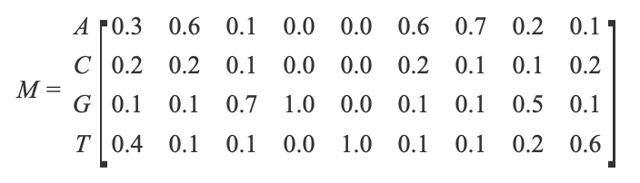

`PSSM`算法是生物信息学领域中的一个常用算法，全名“位置特异性打分矩阵(`position-specific scoring matrix`)”，又称作"位置比重矩阵(`position weight matrix`)".有关该方法更多的细节，详见维基百科[Position weight matrix](https://en.wikipedia.org/wiki/Position_weight_matrix).本文仅阐述其设计思想，实际项目的例子将在另一篇文章中进行介绍.

PWM矩阵是表示motif的一种方式，全称是position-specific weight matrix (PSWM) 或者是position-specific scoring matrix (PSSM)。比如CTCF的motif序列为（来自于JASPAR数据库）：


## 建模思想

一个`PWM`包含`N`行(列)，当模型为`DNA`时，`N=4`；当模型为蛋白质时，`N=20`。维基百科给出的是`DNA`的核苷酸序列的例子，对于我们的项目来说，不同的也仅仅是矩阵行列数而已：组成`DNA`的基本核苷酸有`A,C,G,T`四种，故行列式有四行(列)；组成蛋白质的基本氨基酸有二十种，故行列式有二十行(列)。同时`PWM`对于每个不同位置都对应一列(行)数据。而选择基本核苷酸(氨基酸)作为行或列，需要针对各自的需要进行调整。

## 构建位置频度矩阵(`PFM`)

位置频度矩阵(`position frequency matrix`)的构建的思路还是比较简单的，这里仍然以维基百科的例子介绍。`DNA`序列如下表所示：

```

GAGGTAAAC
TCCGTAAGT
CAGGTTGGA
ACAGTCAGT
TAGGTCATT
TAGGTACTG
ATGGTAACT
CAGGTATAC
TGTGTGAGT
AAGGTAAGT
```

共有`10`行`9`列，则相应的`PFM`为*[Math Processing Error]*

这个矩阵的列数也是`9`，而每一列的数各自加起来正好是`10`，也就是`DNA`序列的行数。这样，构建矩阵的原理就很清晰了：**计算每一列中的各核苷酸的数量，然后存入矩阵的相应位置**。

## 构建位置概率矩阵(`PPM`)

通过`PFM`求`PPM`，只需要下面的公式：
$$
M_{k,j}=\frac{1}{N}\sum_{i=1}^{N}I(X_{i,j}=k)
$$
其中，`i`为行号，`j`为列号，即：

$$
i\in(1,2,...,N),j\in(1,2,...,N)
$$


且*`I`*是指示函数，即：


$$
I_{X_{i,j}=k}=
\begin{cases}
1 ,if X_{i,j}=k;\\
0 ,if X_{i,j}\not=k;
\end{cases}
$$


则1.1中的`PFM`相应的`PPM`为：



在这里有一点需要**特别注意**：

> 对于每一个匹配成功的核苷酸，我们计分为1，未匹配则记为0，这只是一个简单的思想。而在实际情况下，我们用BLAST或者PSI-BLAST等程序求序列的PSSM时，相应的打分规则就要复杂许多。这时候就需要根据自身的需要选择相应的各种参数，如:gap,λ。

关于上面一段话中提及的程序，更多的细节请点击：
https://en.wikipedia.org/wiki/BLAST
http://blast.ncbi.nlm.nih.gov/Blast.cgi
http://www.ebi.ac.uk/Tools/sss/psiblast/
http://blast.ncbi.nlm.nih.gov/Blast.cgi?CMD=Web&PAGE=Proteins&PROGRAM=blastp&RUN_PSIBLAST=on

我们假定这些矩阵在行列式的每个位置上都是统计独立的。非统计独立模型请参考`Chris`的一篇文章http://www.nohup.cc/article/111/，这里就不赘述了。那么对于`DNA`序列`S=GAGGTAAAC`来说，它出现的概率就是 *p*(*S*∣*M*)=0.1×0.6×0.7×1.0×1.0×0.6×0.7×0.2×0.2=0.0007056

## 构建位置比重矩阵(`PWM`)

这里引入一个参数`b`，`b=1/k`,其中，当序列为蛋白质序列时，`k=20`；序列为`DNA`时，`k=4`.那么对于相同的位置上的`PWM`和`PPM`的矩阵元素，其关系为：

要构建出PWM矩阵，首先要得到position frequency matrix (PFM)，即在每个位置的四种核苷酸出现的次数。比如说CTCF的PFM序列为 (图中为JASPAR中的.jaspar文件):([https://jaspar.genereg.net/matrix/MA0001.1/](https://jaspar.genereg.net/matrix/MA0001.1/))

```
>MA0001.1	AGL3
A  [     0      3     79     40     66     48     65     11     65      0 ]
C  [    94     75      4      3      1      2      5      2      3      3 ]
G  [     1      0      3      4      1      0      5      3     28     88 ]
T  [     2     19     11     50     29     47     22     81      1      6 ]
```

也就是在第一个位置A出现了87次，C出现了291次，G出现了76次，T出现了459次。将每个位置的频数转换为频率 (某核苷酸的出现数量/这个位置四种核苷酸的总数量)，可以得到position probability matrix (PPM) (图中行列互换 用的是JASPAR中的.meme文件)：

```
MEME version 4

ALPHABET= ACGT

strands: + -

Background letter frequencies
A 0.25 C 0.25 G 0.25 T 0.25

MOTIF MA0001.1 AGL3
letter-probability matrix: alength= 4 w= 10 nsites= 97 E= 0
 0.000000  0.969072  0.010309  0.020619
 0.030928  0.773196  0.000000  0.195876
 0.814433  0.041237  0.030928  0.113402
 0.412371  0.030928  0.041237  0.515464
 0.680412  0.010309  0.010309  0.298969
 0.494845  0.020619  0.000000  0.484536
 0.670103  0.051546  0.051546  0.226804
 0.113402  0.020619  0.030928  0.835052
 0.670103  0.030928  0.288660  0.010309
 0.000000  0.030928  0.907216  0.061856
URL http://jaspar.genereg.net/matrix/MA0001.1
```

最后通过以下公式将PPM转换为PWM：
$$
M_{PWM}=ln(\frac{M_{PPM}}{b})
$$
其中M是指的这个位点的probability，b是指的background (上图的background为0.25)。上图中CTCF的PPM转化为PWM为.

那么1.2中的`PPM`相对应的`PWM`为：


## R语言包

seqLogo：[https://www.bioconductor.org/packages/release/bioc/html/seqLogo.html](https://www.bioconductor.org/packages/release/bioc/html/seqLogo.html)

ggseqlogo：[https://github.com/omarwagih/ggseqlogo](https://github.com/omarwagih/ggseqlogo)

## 参考链接

R语言可视化（二十七）：序列logo图绘制: [https://www.jianshu.com/p/773e69e37b1f/](https://www.jianshu.com/p/773e69e37b1f/)

Motif中的PWM矩阵：[https://www.jianshu.com/p/b1abf71c78cf?clicktime=1577491465](https://www.jianshu.com/p/b1abf71c78cf?clicktime=1577491465)

构建PSSM的步骤：[http://www.nohup.cc/article/112/#menu_index_5](http://www.nohup.cc/article/112/#menu_index_5)

Position-specific score matrices：[https://www.cs.rice.edu/~ogilvie/comp571/2018/09/11/pssm.html](https://www.cs.rice.edu/~ogilvie/comp571/2018/09/11/pssm.html)

R语言-制作motif的PWM：[https://www.jianshu.com/p/22dd29a423d9](https://www.jianshu.com/p/22dd29a423d9)